# Mermaid diagram templates

Copy the block for the architecture, then rename nodes to the user's domain (services, modules,
events, tables). Keep labels in the user's language. All render in Obsidian, GitHub and most
docs tools.

## 1. Layered monolith
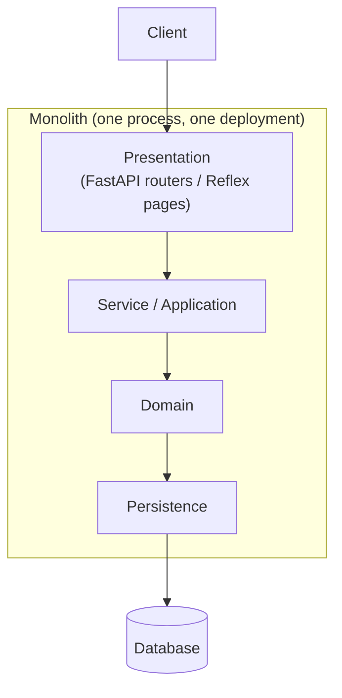

## 2. Modular monolith
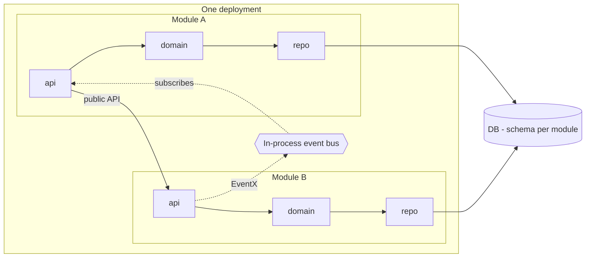

## 3. Client-server
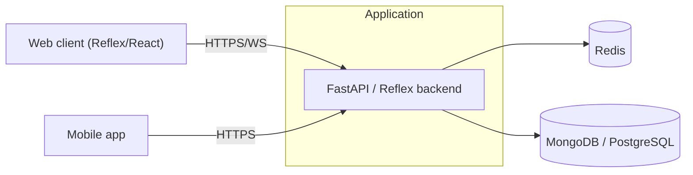

## 4. Microservices
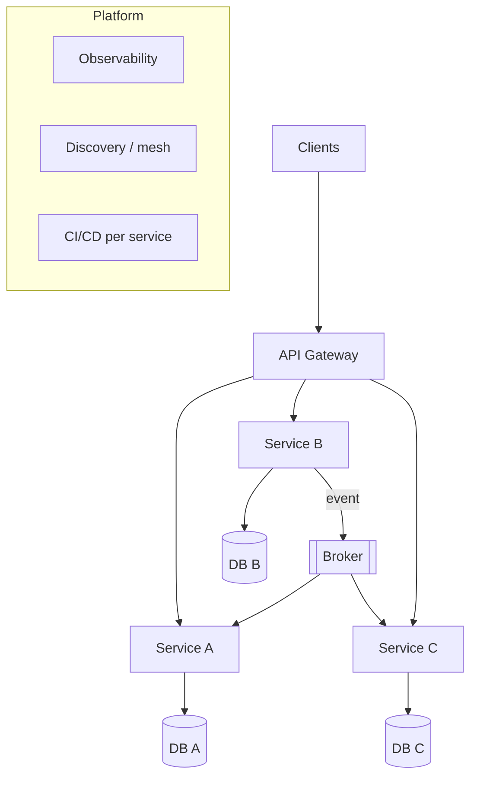

## 5. SOA
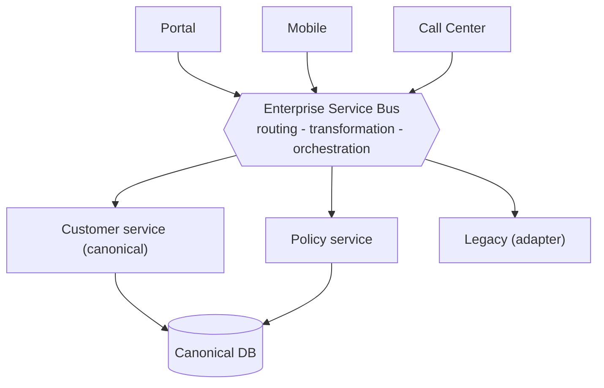

## 6. Event-driven (broker + mediator)
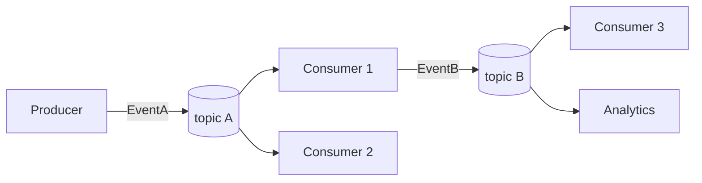
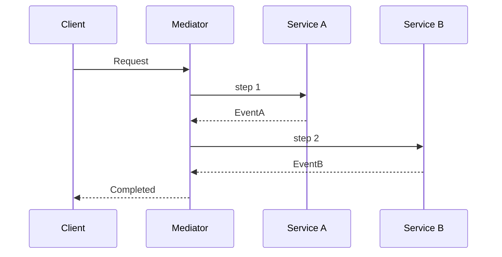

## 7. Serverless
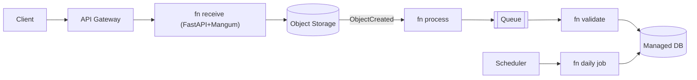

## 8. Hexagonal
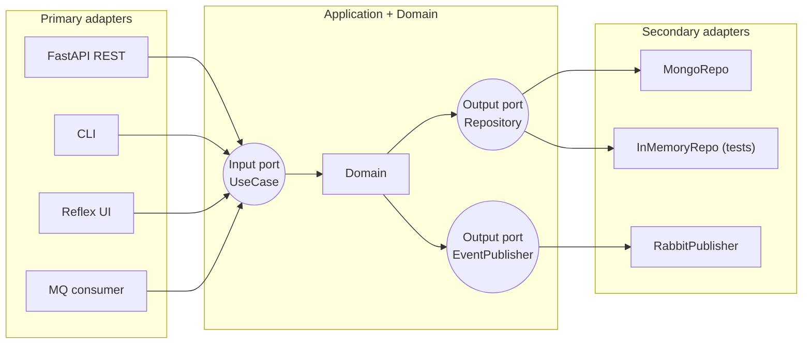

## 9. Clean / Onion
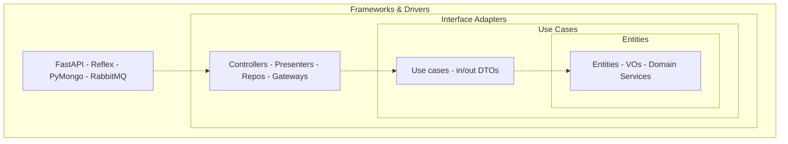

## 10. CQRS + Event Sourcing
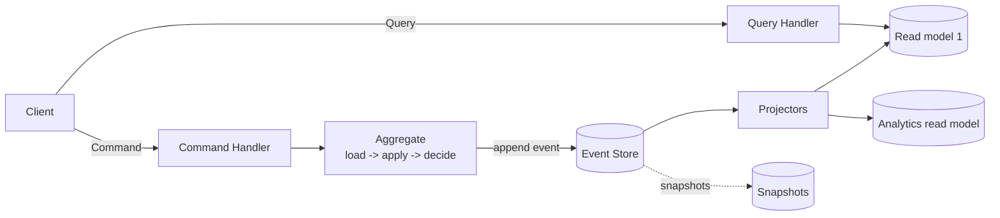

## 11. Microkernel
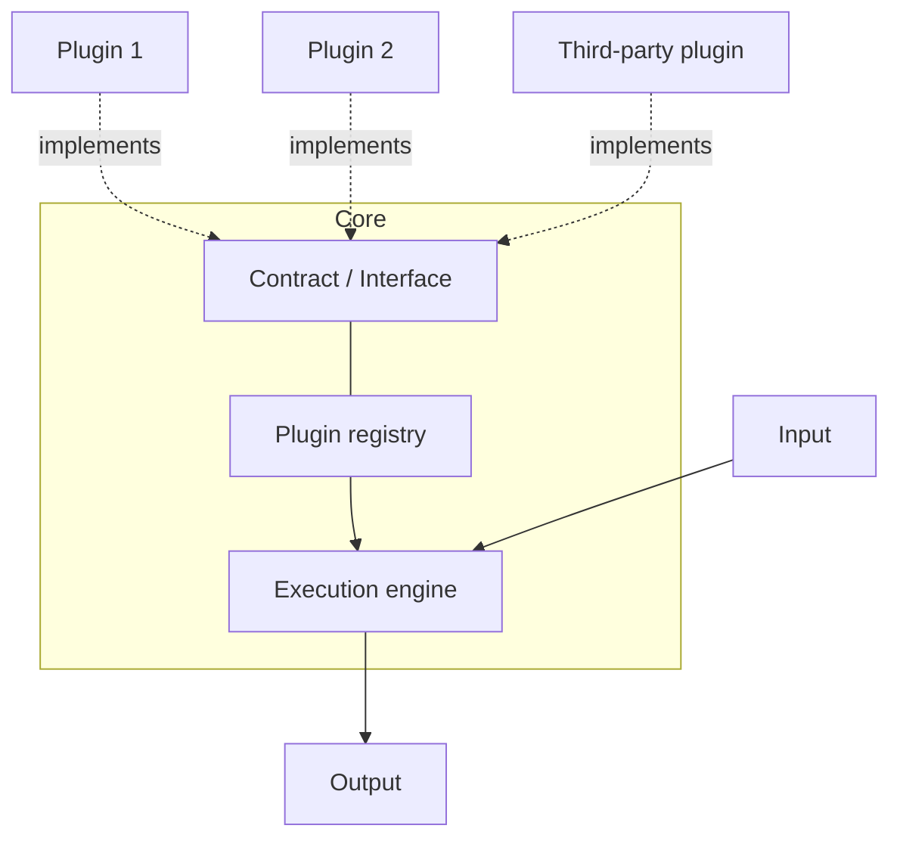

## 12. Pipes & Filters
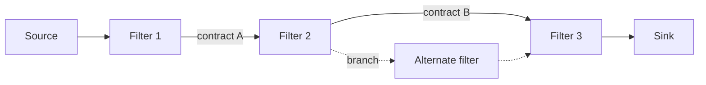

## 13. Space-Based
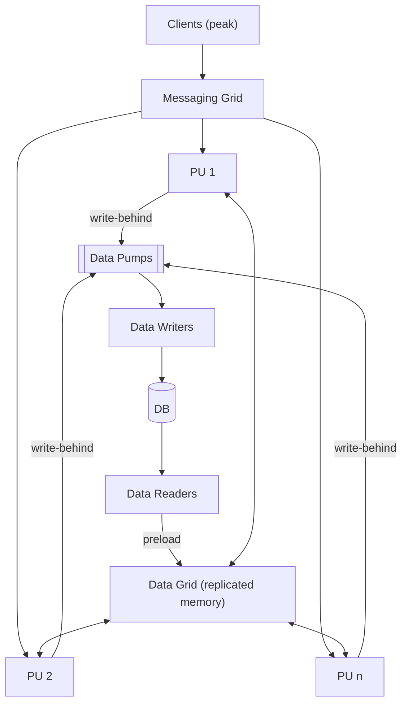

## 14. Service-Based
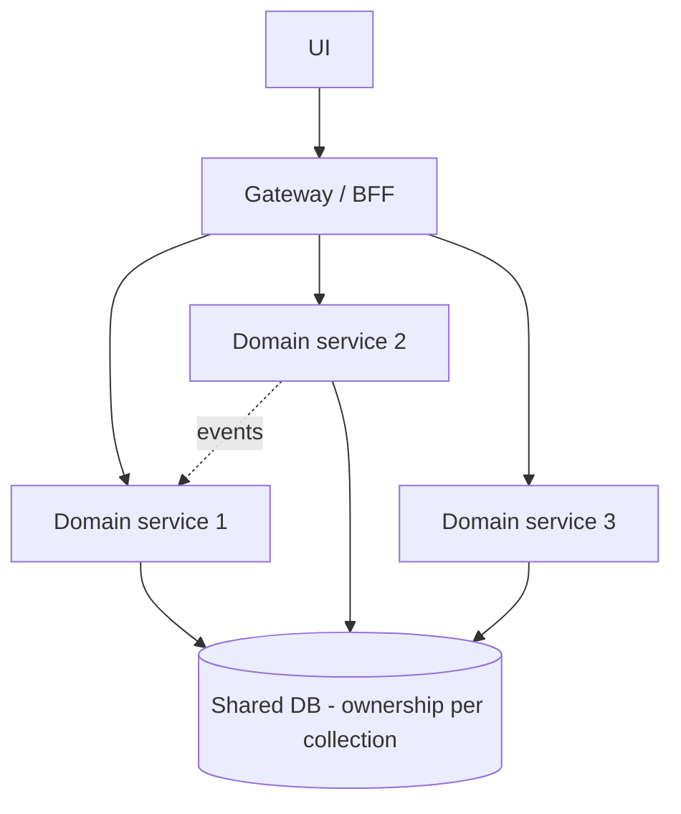

## 15. Micro-frontends
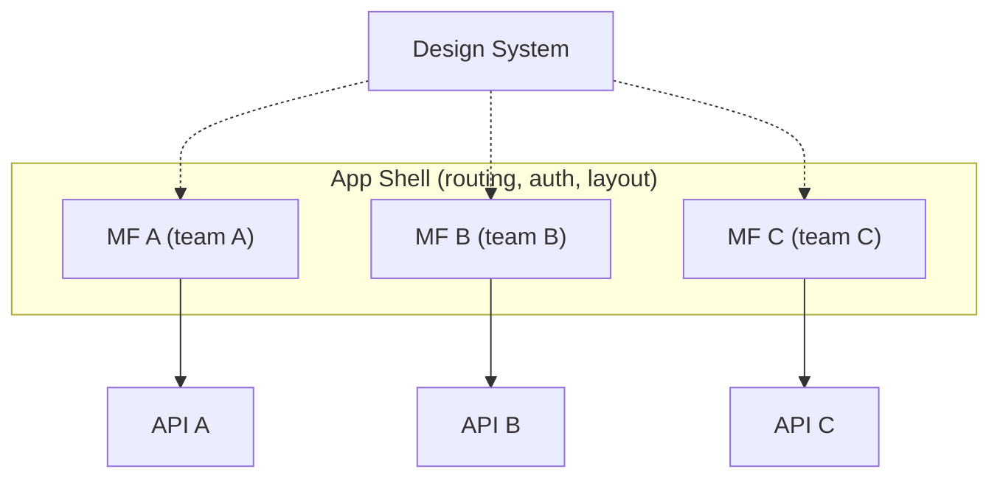

## 16. Peer-to-Peer
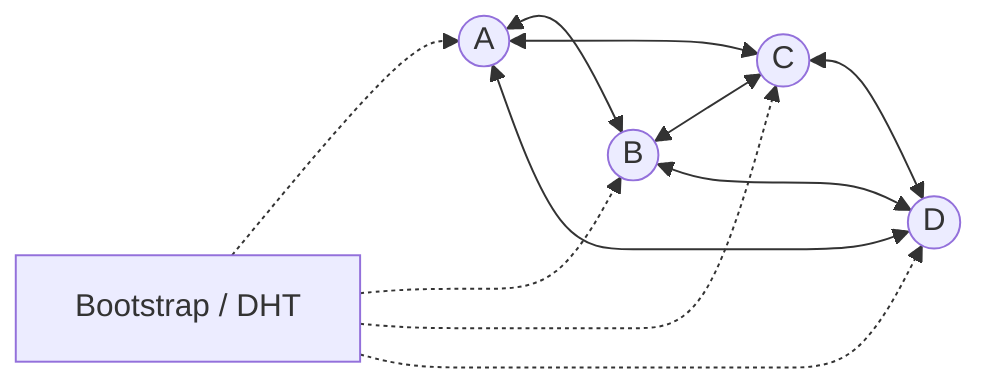

## 17. Cell-Based
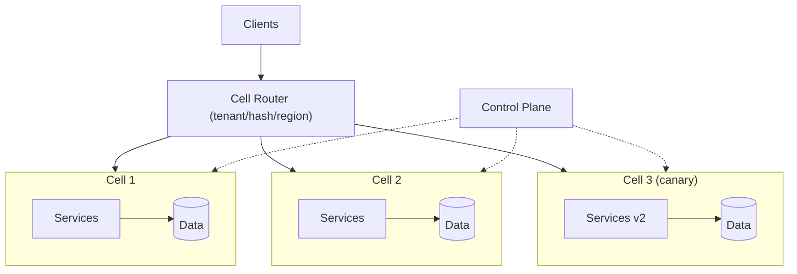

## 18. Agentic
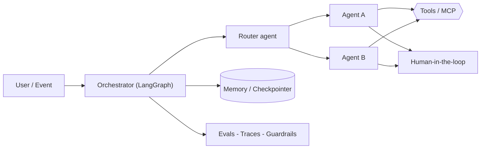

## 19. DOMA
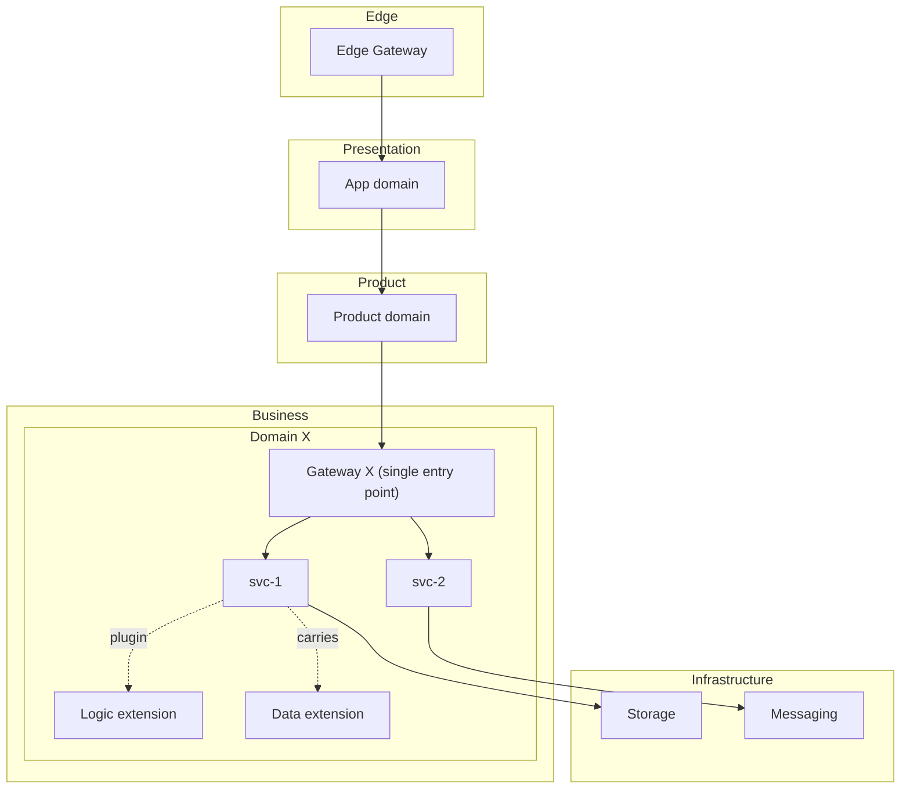

## Combined reference system
```mermaid
flowchart TB
    MF["Micro-frontends / Reflex apps"] --> GW["API Gateway / BFF"]
    subgraph Core["Services (Service-Based -> Microservices -> DOMA)"]
        S1["Domain A<br/>Hexagonal + Clean"]; S2["Domain B<br/>Hexagonal + CQRS/ES"]; S3["Domain C<br/>Pipes & Filters + Microkernel"]
    end
    GW --> S1 & S2 & S3
    S1 & S2 & S3 <--> BUS[["Event Bus (EDA)"]]
    BUS --> FN["Serverless (notifications, ETL)"] & AG["LLM agents"]
```

## Decision tree
```mermaid
flowchart TD
    Q1{"How many teams?"} -->|1-2| Q2{"Complex domain / long lifespan?"}
    Q1 -->|3+| Q3{"DevOps maturity?"}
    Q2 -->|No| MONO["Layered monolith"]
    Q2 -->|Yes| MM["Modular monolith + Hexagonal/Clean"]
    Q3 -->|Low| SB["Service-Based"]
    Q3 -->|High| MS["Microservices"] -->|hundreds of services| DOMA["DOMA"]
    MM & SB & MS --> Q4{"Async / peaks?"} -->|Yes| EDA["+ EDA"]
    Q4 -->|No| FIN["Done"]
    EDA --> Q5{"Audit / contention?"} -->|Yes| CQRS["+ CQRS (+- ES)"]
    Q5 -->|No| Q6{"Sporadic workloads?"} -->|Yes| SLS["+ Serverless"]
    CQRS --> Q6
    Q6 -->|No| FIN
```
